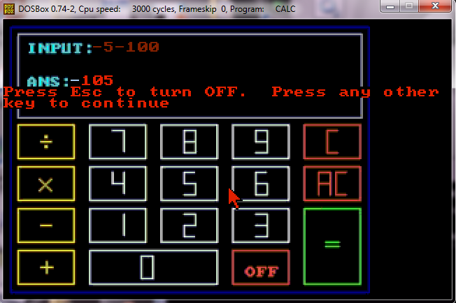
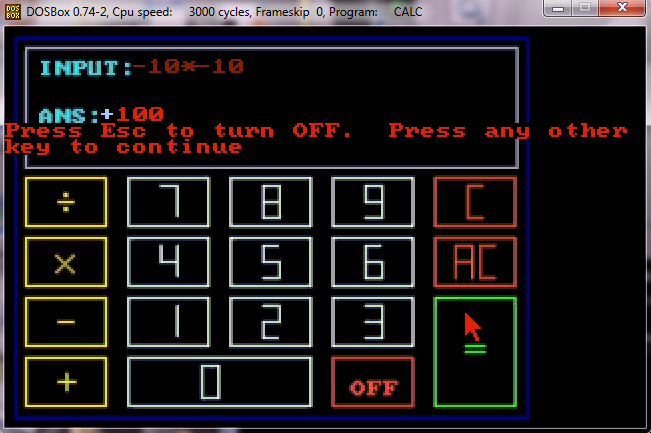
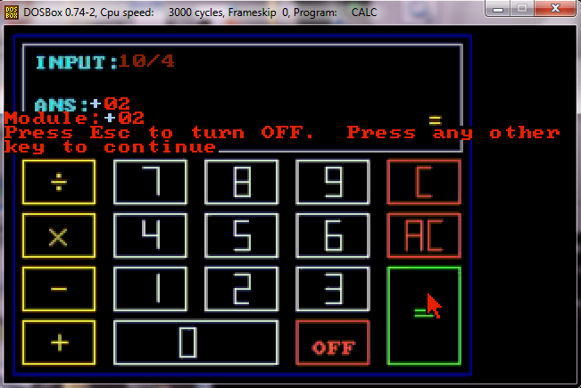

# Assembly Calculator

This is an old Calculator Project written in Assembly ;)

**__NOTE:__** This code was from my highschool's finals project. It should definitely be refactored!

## Files

* `calc.asm` - The whole assembly code responsible for operating the calculator.

* `s.bmp` - The initial image which pops up when starting the calculator.

* `c.bmp` - The base image of the calculator. Upon this base image the calculator will display its logic.

* `examples/*` - The examples files showing actual usage of the calculator. It has some interesting cases!

## Examples

### Addition

---

### Subtraction

---

### Multiplication

---

### Division

---

**__NOTE:__** More example images exist under the [examples](examples) directory.
